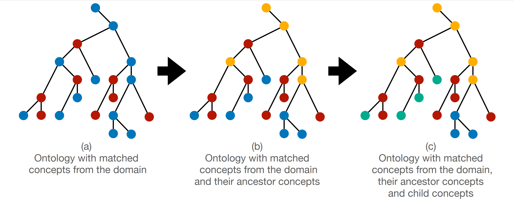

# Ontology Evaluation using Transformers



### Requirements
- Install Python 3.9
- Create virtual environment (via `VENV` or `Anaconda`)  
- Install dependencies
```shell
pip install -r requirements.txt
```

### Running
Run `main.py`

Change the ontology evaluated by updating the file name:
```python
def main():
    ontology_file = 'envo.owl'
```

### BERT Pre-training
The code that was used to pre-train the model is available under `bert-pre-training`.
The text that was used is available under `artifacts/text`. It is the combination of all papers in a single text file.


### Citation

```bibtex
@inproceedings{10.1145/3543873.3587617,
	title        = {Automated Ontology Evaluation: Evaluating Coverage and Correctness Using a Domain Corpus},
	author       = {Zaitoun, Antonio and Sagi, Tomer and Hose, Katja},
	year         = 2023,
	booktitle    = {Companion Proceedings of the ACM Web Conference 2023},
	location     = {Austin, TX, USA},
	publisher    = {Association for Computing Machinery},
	address      = {New York, NY, USA},
	series       = {WWW '23 Companion},
	pages        = {1127–1137},
	doi          = {10.1145/3543873.3587617},
	isbn         = 9781450394192,
	url          = {https://doi.org/10.1145/3543873.3587617},
	abstract     = {Ontologies conceptualize domains and are a crucial part of web semantics and information systems. However, re-using an existing ontology for a new task requires a detailed evaluation of the candidate ontology as it may cover only a subset of the domain concepts, contain information that is redundant or misleading, and have inaccurate relations and hierarchies between concepts. Manual evaluation of large and complex ontologies is a tedious task. Thus, a few approaches have been proposed for automated evaluation, ranging from concept coverage to ontology generation from a corpus. Existing approaches, however, are limited by their dependence on external structured knowledge sources, such as a thesaurus, as well as by their inability to evaluate semantic relationships. In this paper, we propose a novel framework to automatically evaluate the domain coverage and semantic correctness of existing ontologies based on domain information derived from text. The approach uses a domain-tuned named-entity-recognition model to extract phrasal concepts. The extracted concepts are then used as a representation of the domain against which we evaluate the candidate ontology’s concepts. We further employ a domain-tuned language model to determine the semantic correctness of the candidate ontology’s relations. We demonstrate our automated approach on several large ontologies from the oceanographic domain and show its agreement with a manual evaluation by domain experts and its superiority over the state-of-the-art.},
	numpages     = 11,
	keywords     = {natural language processing, BERT, knowledge engineering, ontology}
}

```
